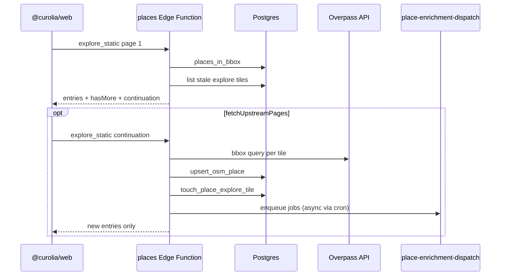

# Explore places (global dataset + paginated API)

Technical reference for the map **Explore** static-places feature: a shared PostGIS catalog, the `places` Edge Function, tile-based upstream refresh from OpenStreetMap (Overpass), and the web client integration.

## Overview

| Layer                           | Role                                                                  |
| ------------------------------- | --------------------------------------------------------------------- |
| **PostGIS `places` table**      | Canonical global OSM-sourced catalog; public read, service-role write |
| **`places` Edge Function**      | `explore_static` (paginated JSON), `get_place`, admin batch helpers   |
| **`place-enrichment-dispatch`** | Background Wikipedia / Commons metadata for new places                |
| **POI explore plugin**          | Declares categories; calls host `fetchStaticPlaces`                   |
| **`@curolia/web`**              | Viewport debouncing, React Query, map layer + explore panel           |

Design goals:

1. **Fast first paint** — page 1 is always a local DB query (no Overpass on the critical path).
2. **Client-controlled upstream** — page 1 returns `hasMore` + `continuation`; the client chooses whether to fetch slower upstream pages.
3. **Pure JSON** — `Content-Type: application/json` (no NDJSON streaming).
4. **Stable pagination** — later pages never repeat place IDs already sent on earlier pages in the same request chain, even if Overpass returns overlapping data.

## Architecture



## Database schema

Migrations (apply with `npm run db:migrate -w @curolia/supabase`):

| Migration                                            | Contents                                                                                     |
| ---------------------------------------------------- | -------------------------------------------------------------------------------------------- |
| `20260626120000_places_explore.sql`                  | `places`, `place_metadata`, `place_enrichment_jobs`, `pins.place_id`, pin-count triggers     |
| `20260626120100_places_rpc.sql`                      | `upsert_osm_place`, `places_in_bbox`, `places_cluster_in_bbox`, `recompute_place_prominence` |
| `20260626120200_place_enrichment_auto_dispatch.sql`  | pg_cron → `place-enrichment-dispatch`                                                        |
| `20260626120300_place_explore_tiles_and_enqueue.sql` | `place_explore_tiles`, `enqueue_place_enrichment_job`, `touch_place_explore_tile`            |
| `20260626120400_place_enrichment_enqueue_dedupe.sql` | Race-safe enqueue (`unique_violation` handler)                                               |

### `places`

- PostGIS `geography(Point, 4326)` geometry, generated `lat`/`lng`
- `source` + `source_ref` (e.g. `osm` + `node/123`) — unique per OSM entity
- `primary_category`, `categories[]`, `prominence_score`, `pin_count`
- Public `SELECT` for anon/authenticated; writes via service role / RPCs

### `place_explore_tiles`

Tracks when a **category + tile** was last refreshed from Overpass.

- Primary key: `(category_id, tile_deg, tile_x, tile_y)`
- Used to decide `hasMore` on page 1 and which tiles remain in the continuation token

### `place_enrichment_jobs`

Outbox for wikidata / commons enrichment. Active jobs deduped via partial unique index on `(plugin_type_id, place_id, event)` where `status IN ('pending', 'processing')`. Enqueue goes through `enqueue_place_enrichment_job()` RPC.

## Edge Function: `places`

Source: `packages/supabase/supabase/functions/places/`

`verify_jwt = false` in `config.toml` (client uses anon key or session JWT via `functions.invoke`).

### Actions

| `action`                     | Purpose                                          |
| ---------------------------- | ------------------------------------------------ |
| `explore_static`             | Paginated explore results (see below)            |
| `get_place`                  | Single place + normalized `place_metadata`       |
| `recompute_prominence_batch` | Service maintenance (batch prominence recompute) |

### `explore_static` — page 1 (cache)

**Request:**

```json
{
  "action": "explore_static",
  "bounds": { "west", "south", "east", "north" },
  "zoom": 14,
  "categoryId": "poi:parks",
  "mapCenter": { "lng": 5.12, "lat": 52.09 },
  "hiddenGems": false
}
```

**Response** (`application/json`):

```json
{
  "page": 1,
  "source": "cache",
  "hasMore": true,
  "continuation": "<base64-json>",
  "entries": [
    /* ExploreResultEntry[] */
  ]
}
```

Behavior:

- **Zoom &lt; 9** (`ZOOM_DATASET`): PostGIS clusters + up to 8 anchor places; `hasMore` is always false.
- **Zoom ≥ 9**: `places_in_bbox` for the viewport (limit 60, prominence ordering). Stale tiles are computed but **not** fetched on page 1.
- `hasMore: true` when at least one explore tile is missing or past TTL (see [Tile grid](#tile-grid)).
- `continuation` omitted when `hasMore` is false.

### `explore_static` — page 2+ (upstream)

**Request:**

```json
{
  "action": "explore_static",
  "continuation": "<token from prior page>"
}
```

**Response:**

```json
{
  "page": 2,
  "source": "upstream",
  "hasMore": true,
  "continuation": "<next-token>",
  "entries": [
    /* only NEW place ids */
  ]
}
```

Each continuation page:

1. Decodes the opaque token (server-issued; do not construct client-side).
2. Refreshes up to **`MAX_TILES_UPSTREAM_PER_REQUEST` (2)** pending tiles from Overpass.
3. Upserts OSM hits into `places` (existing rows updated, not re-enqueued for enrichment).
4. Returns entries whose `id` is **not** in `excludedPlaceIds` from the token.
5. Appends new entry IDs to `excludedPlaceIds` for the next token.
6. Marks successfully fetched tiles via `touch_place_explore_tile`.
7. Sets `hasMore` when pending tiles remain.

**Pagination invariant:** Places shown on page 1 (or any earlier page in the chain) are never returned again on later pages, even if Overpass returns the same OSM entities. Upserts still land in the DB so the **next** explore query’s page 1 can include them from cache.

### Continuation token payload

Encoded in `packages/supabase/supabase/functions/places/lib/continuation.ts` (base64 JSON, `v: 1`):

```ts
{
  v: 1;
  bounds: ExploreBounds;
  categoryId: string;
  zoom: number;
  mapCenter: { lng: number; lat: number } | null;
  hiddenGems: boolean;
  tileDeg: number;
  excludedPlaceIds: string[];
  pendingTiles: { tileX: number; tileY: number }[];
  page: number; // next page number to emit
}
```

### Zoom tiers

| Zoom   | Data source                                              |
| ------ | -------------------------------------------------------- |
| &lt; 9 | `places_cluster_in_bbox` + sparse anchors                |
| 9–12   | DB bbox query; upstream tiles use 0.14° cells            |
| 11–12  | Tile size 0.07°                                          |
| ≥ 13   | Tile size 0.035° (`ZOOM_LIVE` threshold for finer tiles) |

Constants live in `places/lib/constants.ts` and `places/lib/tiles.ts`.

### Tile grid

- Viewport bounds are split into a grid: `tileX = floor(lng / tileDeg)`, `tileY = floor(lat / tileDeg)`.
- **TTL:** 7 days at zoom ≥ 13; 14 days below that.
- A tile is **stale** if never fetched or `fetched_at` is older than TTL.
- Overpass timeout per tile: **20s**; per-page wall budget: **9s** across tiles in the batch.

Overpass mirrors are configured in `places/lib/overpass-bbox.ts` (no API key).

### Entry shape

Matches `@curolia/plugin-contract` `ExploreResultEntry` for places (`featureKind: "place"`) or clusters (`featureKind: "cluster"`). See `places/lib/explore-db.ts` (`placeRowToEntry`).

## Background enrichment

When a **new** OSM place is inserted (`upsert_osm_place` returns a new id), the function enqueues `wikidata` and `commons` jobs via `enqueue_place_enrichment_job`.

**Dispatcher:** `place-enrichment-dispatch` Edge Function

- Auth: `Authorization: Bearer $PLUGIN_SYNC_DISPATCH_SECRET` (not a Supabase JWT).
- Invoked every minute by pg_cron when pending jobs exist (`20260626120200_place_enrichment_auto_dispatch.sql`).
- `verify_jwt = false` in `config.toml` (required for cron bearer).

Local setup:

1. Set `PLUGIN_SYNC_DISPATCH_SECRET` in `packages/supabase/supabase/functions/.env`.
2. Sync into DB: `npm run db:sync-dispatch-secret -w @curolia/supabase`.
3. Restart functions after `config.toml` changes.

Enrichment writes rows into `place_metadata` (Wikipedia extract/URL, photo URL, commons photo count) and triggers `recompute_place_prominence`.

## Web client

| File                                                   | Responsibility                                                                                      |
| ------------------------------------------------------ | --------------------------------------------------------------------------------------------------- |
| `apps/web/src/lib/explore-edge.ts`                     | `placesExploreStatic`, `placesExploreStaticPage`; optional auto-pagination via `fetchUpstreamPages` |
| `apps/web/src/lib/explore-services.ts`                 | `createExploreHostServices().fetchStaticPlaces`                                                     |
| `apps/web/src/lib/explore-results.ts`                  | Plugin `fetchResults` orchestration; parallel multi-category fetch                                  |
| `apps/web/src/hooks/use-explore-results.ts`            | React Query; debounced viewport; `fetchUpstreamPages: true` for map                                 |
| `apps/web/src/hooks/use-debounced-explore-viewport.ts` | 450ms debounce after pan/zoom/resize                                                                |
| `apps/web/src/lib/explore-viewport.ts`                 | Quantized bounds for stable query keys                                                              |

### Client flow

1. Map camera idle → viewport state updates (equality-guarded).
2. Debounced viewport triggers `useExploreMapResults` query.
3. Each active POI category calls `fetchStaticPlaces` with `fetchUpstreamPages: true` (default in explore-services).
4. Page 1 returns immediately; `onUpdate` merges entries into React Query cache.
5. Client loops `continuation` until `hasMore` is false or `AbortSignal` aborts (viewport change).
6. Map layer and explore panel share **one** query result set (panel filters by focused category).

To show **cache only** (no Overpass): pass `fetchUpstreamPages: false` on `ExploreStaticFetchInput` / `ExploreFetchContext`.

### Plugin contract

- `ExploreStaticFetchInput`: `onUpdate`, `fetchUpstreamPages`, `signal`
- `ExploreFetchContext`: same fields for `fetchResults`
- POI plugin (`packages/plugins/poi/src/explore/index.ts`) delegates to `services.fetchStaticPlaces`

Route explore categories use a separate `route` Edge Function (ORS); not covered here.

## Configuration

| Variable                                    | Used by                               |
| ------------------------------------------- | ------------------------------------- |
| `SUPABASE_URL`, `SUPABASE_SERVICE_ROLE_KEY` | `places`, `place-enrichment-dispatch` |
| `PLUGIN_SYNC_DISPATCH_SECRET`               | `place-enrichment-dispatch` + pg_cron |
| `ORS_API_KEY`                               | `route` function only                 |

Overpass requires no key. See `packages/supabase/supabase/functions/.env.example`.

## Local development

```bash
npm run db:migrate -w @curolia/supabase
npm run db:types -w @curolia/supabase
npm run db:sync-dispatch-secret -w @curolia/supabase   # after setting PLUGIN_SYNC_DISPATCH_SECRET
npx turbo run functions:sync
npm run functions:start -w @curolia/supabase   # or npm run dev from root
```

Edit function sources under `packages/supabase/supabase/functions/places/` (not synced from a plugin package).

## Related files

```
packages/supabase/supabase/functions/places/
  index.ts                 # HTTP handlers
  lib/constants.ts         # zoom limits, category OSM filters
  lib/continuation.ts      # pagination token encode/decode
  lib/explore-db.ts        # bbox queries, entry mapping
  lib/tiles.ts             # tile grid + staleness
  lib/overpass-bbox.ts     # Overpass fetch + LRU cache

packages/supabase/supabase/functions/place-enrichment-dispatch/
  index.ts                 # job drain + wikidata/commons

apps/web/src/lib/explore-edge.ts
apps/web/src/hooks/use-explore-results.ts
packages/plugins/poi/src/explore/index.ts
packages/plugin-contract/src/explore.ts
```
